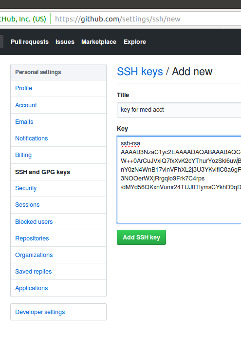

# README.md

# Invitation

I invite you to join me in the development of this repo.

I am easy to reach: bikle101@gmail.com

If you live near 94024, I can meet you in person.

# Setup Your Dev Env

I ask that you do your development on Ubuntu 16.04 which I use.

If we both use the same OS, development is smoother.

If you have no Ubuntu 16.04 host, you can install one inside your laptop.

I do this on my laptop using software called: "Virtualbox":

https://www.virtualbox.org/wiki/Downloads

After you install Virtualbox, you can create a blank copy of Ubuntu inside your laptop.

Or, you can import a copy of Ubuntu created by another person, like me.

I have a Virtualbox Ubuntu appliance you can use:

https://drive.google.com/file/d/10p1W7kqzxE69jODhUzcb-qi-osN4htO-

I suggest that you use the above appliance.

After you import the above appliance into your laptop,
you can login to the "ann" account using password: 'a'.

After that, I suggest you change the password.

Next, create an account named 'ml611':

```
sudo useradd -m -s /bin/bash -G sudo ml611
sudo passwd ml611
```

Generate keys:

```
ssh -AY ml611@localhost
ssh-keygen -t rsa
```

Install software:

```
sudo apt update

sudo apt upgrade

sudo apt install build-essential libssl-dev             \
libreadline6-dev zlib1g-dev libncurses5-dev libffi-dev  \
libgdbm3 libgdbm-dev sqlite3 libsqlite3-dev libyaml-dev \
emacs postgresql postgresql-server-dev-all nodejs       \
libpq-dev wget curl gitk ruby ruby-dev autoconf bison
```

If Ubuntu complains about apt update, just give it 30 minutes to "catch-up".

After you install the software listed above, you should install more software:

```
cd ~ml611
git clone https://github.com/rbenv/rbenv      .rbenv
git clone https://github.com/rbenv/ruby-build .rbenv/plugins/ruby-build
curl -L rails4.us/.gemrc > ~/.gemrc
```

If that goes well you add syntax to ~ml611/.bashrc file:

```
if [ -e ${HOME}/.rbenv ]; then
  export PATH="$HOME/.rbenv/bin:$PATH"
  eval "$(rbenv init -)"
fi
```

Then, you should install more software:

```
bash
rbenv install 2.6.0
rbenv global  2.6.0
gem install rails -v 5.2.2
```

# Github

Next, you should create an account on github.com.

Or, login to your github account.

Then, in the settings, use your mouse to paste ~ml611/.ssh/id_rsa.pub into the ssh-textarea.



Then, you should vist this URL with your browser:

https://github.com/danbikle/ml611

In the upper right, click the fork link which will fork the ml611-repo for you.

Github should respond by showing you the repo of the fork.

Then, you should clone the fork with syntax like this:

```
cd ~ml611
git clone git@github.com:uraccount/ml611
```

The above syntax is an example.

Your account will have a different name than "uraccount".

# Start Webserver on Your Laptop

Next, you should ensure that the ml611-repo has all the gems it needs:

```
cd ~ml611/ml611
bundle
```

Then, you should start the local webserver:

```
cd ~ml611/ml611
script/railss.bash
```

Your Ubuntu-browser should see the webserver at this URL:

localhost:35611/blog

Or you can test it with a curl-Bash-command:

```
/usr/bin/curl localhost:35611/blog
```

# Heroku

Next, visit this URL to create a heroku account:

https://signup.heroku.com/

Then, install Heroku software:

```
cd ~ml611/
wget https://cli-assets.heroku.com/heroku-cli/channels/stable/heroku-cli-linux-x64.tar.gz
tar xf heroku-cli-linux-x64.tar.gz
mv heroku*linux-x64 heroku
echo 'export PATH=${HOME}/heroku/bin:$PATH' >> ~ml611/.bashrc
bash
```

Next, login via bash-command:

```
heroku auth:login
heroku status
```

Then, create an app on heroku:

```
heroku create myml611
```

If someone else has already claimed the name: "myml611", try a different name like: "urml611".

Next, push your copy of the repo to heroku:

```
git push heroku master
```

If that goes well, Heroku will print the URL of your Heroku-site.

You should use your browser or curl to test that site.

# How You Can Participate

To experience a short development iteration, commit a small change to the repo:

```
cd ~ml611/ml611
echo Dan was here > ~ml611/ml611/public/dan.html
git add .
git commit -am more-isbetter
git push origin master
git push heroku master
```

Then, visit your repo on github.

From there, use the web-UI to submit a pull request to danbikle/ml611

Wait for Dan to merge the pull request

Next, git-pull danbikle/ml611 into both copies of your fork repo.

Remember, that you have two copies of the fork repo:

* One copy on github
* One copy on your laptop in the ~ml611/ml611/ folder

Then, git-push the fork into Heroku:

```
git push heroku master
```
